# Support Copilot Token Lab

The same AI support copilot built twice, naive (v1) and optimised (v2), to measure where LLM token spend goes and what each
optimisation buys. **v2 answers the same 140 questions 64% cheaper.**

Write-up: **https://rvshankar45-jpg.github.io/same-bot-cheaper/** · all data is synthetic (a fictional plant shop, "Leafy").

## Architecture

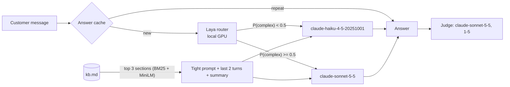

Every optimisation is an independent flag in `config.yaml` (`route`, `retrieve`, `trim_history`, `prompt_cache`,
`tight_prompt`, `output_cap`, `response_cache`). With every flag off, the pipeline *is* v1.

## Results - waterfall (100 queries + 10 conversations = 140 answers)

| variant | flags | total cost | input tokens | output tokens | p50 / p95 latency | quality | % ≥ 4 |
|---|---|---|---|---|---|---|---|
| `v1_naive` | none | $1.953 (+0%) | 631,265 | 68,998 | 3.9s / 9.0s | 4.63 | 95% |
| `plus_route` | route | $1.755 (-10%) | 600,534 | 65,723 | 4.1s / 9.2s | 4.56 | 93% |
| `plus_retrieve` | route, retrieve | $1.125 (-42%) | 276,974 | 63,044 | 3.8s / 9.2s | 4.34 | 86% |
| `plus_trim` | route, retrieve, trim_history | $1.116 (-43%) | 277,478 | 62,739 | 4.0s / 9.3s | 4.39 | 87% |
| `plus_tight_cache` | route, retrieve, trim_history, tight_prompt, prompt_cache | $0.907 (-54%) | 210,500 | 53,766 | 3.5s / 8.4s | 4.40 | 82% |
| `v2_full` | route, retrieve, trim_history, tight_prompt, prompt_cache, output_cap, response_cache | $0.695 (-64%) | 207,233 | 32,480 | 2.7s / 6.3s | 4.49 | 84% |
| `cache_full_kb` | route, tight_prompt, prompt_cache | $0.752 (-62%) | 532,119 | 56,342 | 3.6s / 9.3s | 4.80 | 98% |

`cache_full_kb` is an extra variant (route + tight prompt + prompt cache, **full KB instead of retrieval**): it scored best.

## Results - routing head-to-head (100 queries; routing is the only variable)

| strategy | total cost | quality | simple | complex | router efficiency |
|---|---|---|---|---|---|
| `always_strong` | $0.517 | 4.63 | 4.79 | 4.37 | 0.00 |
| `always_cheap` | $0.155 | 3.91 | 4.42 | 3.08 | 2.01 |
| `laya` | $0.456 | 4.60 | 4.77 | 4.32 | 0.34 |
| `llm_router` | $0.322 | 4.28 | 4.48 | 3.95 | 1.08 |
| `oracle` | $0.336 | 4.40 | 4.42 | 4.37 | 1.00 |
| `laya@0.50` | $0.456 | 4.60 | 4.77 | 4.32 | 0.34 |

Recommended Laya threshold by the pre-registered rule (cheapest cost with complex-query quality within 0.2 of always-strong):
see `results/threshold_sweep.csv`. Laya saves **cost, not tokens**: the same prompt goes to a cheaper model.

## Results - trained routing head (270 separate training questions, 100 held-out test queries)

| router | saving vs always-Sonnet | quality | AUC (Haiku ok) |
|---|---|---|---|
| `laya_head` | 20% | 4.54 | 0.75 |
| `minilm_head` | 15% | 4.58 | 0.66 |
| `length_rule` | 13% | 4.59 | 0.76 |
| `always_sonnet` | 0% | 4.63 |  |
| `always_haiku` | 70% | 3.91 |  |
| `laya_zero_shot@0.50` | 12% | 4.60 | 0.63 |
| `oracle_labels` | 35% | 4.40 | 0.72 |
| `hindsight_ceiling` | 38% | 4.68 | 1.00 |

## Results - thinking effort within Sonnet (50 stratified queries)

| strategy | thinking | cost (50 q) | thinking tokens | quality | complex |
|---|---|---|---|---|---|
| `always_strong` | off | $0.264 | 0 | 4.62 | 4.45 |
| `always_cheap` | off | $0.077 | 0 | 3.80 | 3.15 |
| `laya` | off | $0.237 | 0 | 4.62 | 4.45 |
| `llm_router` | off | $0.175 | 0 | 4.34 | 4.30 |
| `oracle` | off | $0.176 | 0 | 4.32 | 4.45 |
| `sonnet_low` | on (low) | $0.241 | 1,683 | 4.66 | 4.60 |
| `sonnet_medium` | on (medium) | $0.259 | 3,433 | 4.62 | 4.50 |
| `sonnet_high` | on (high) | $0.307 | 8,335 | 4.66 | 4.65 |

## Charts

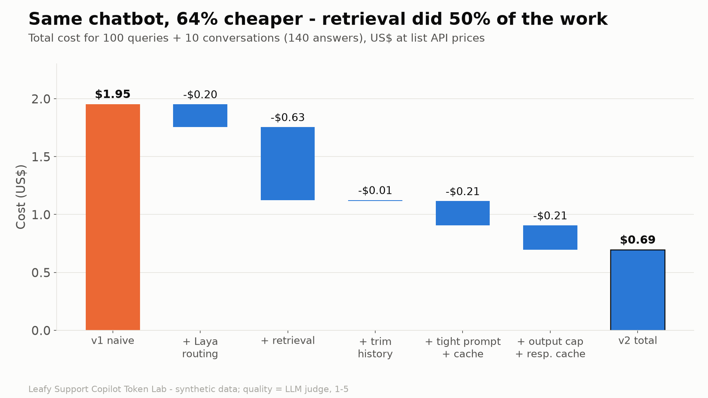
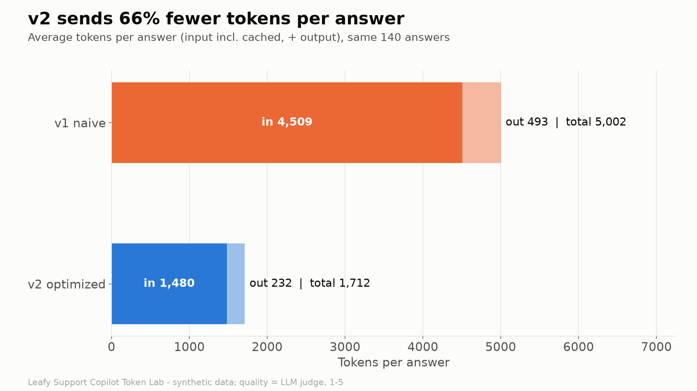
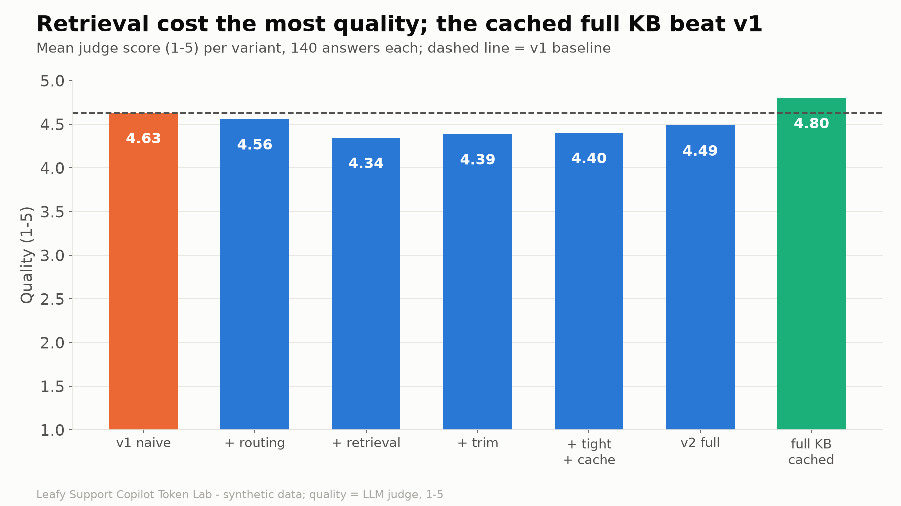
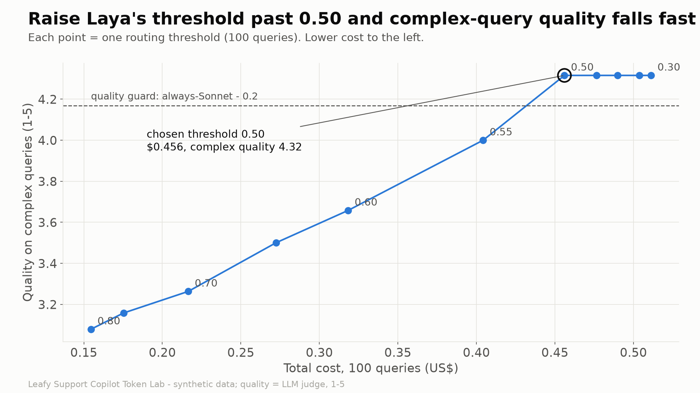
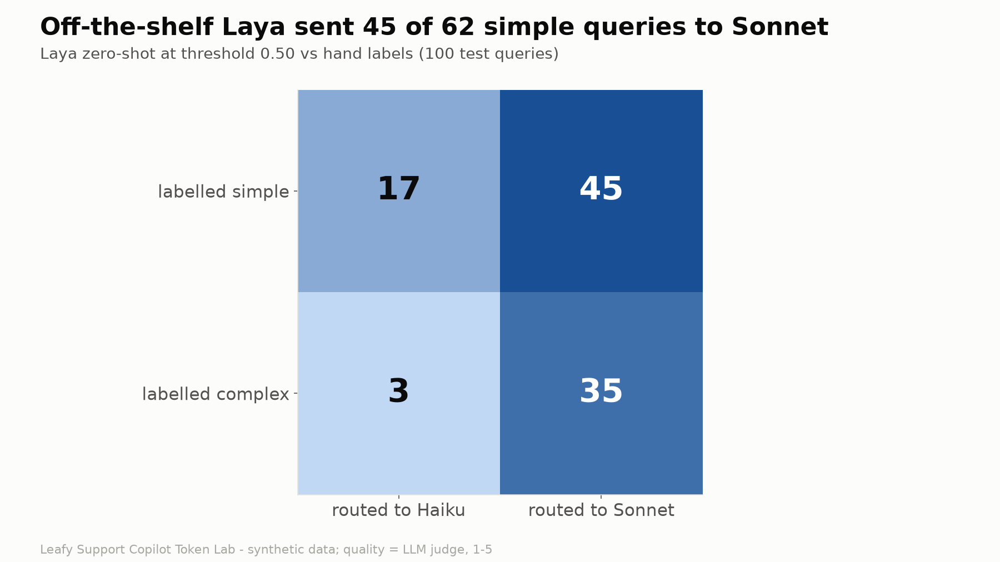
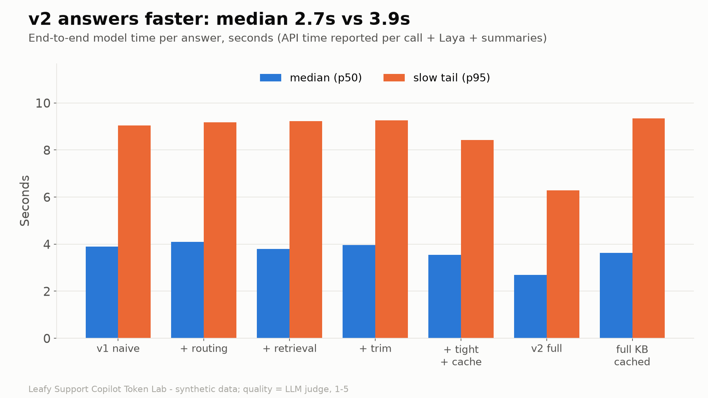
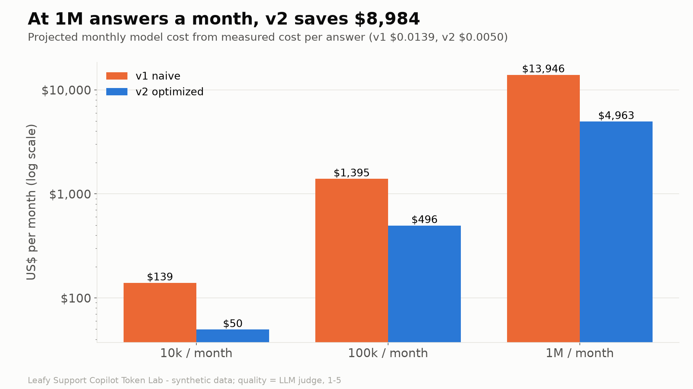
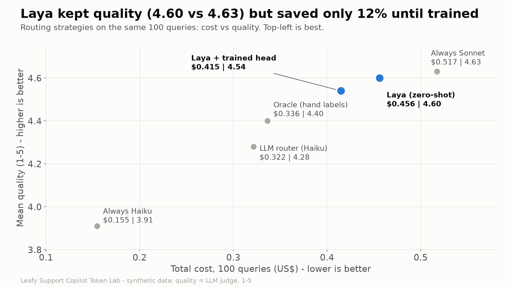
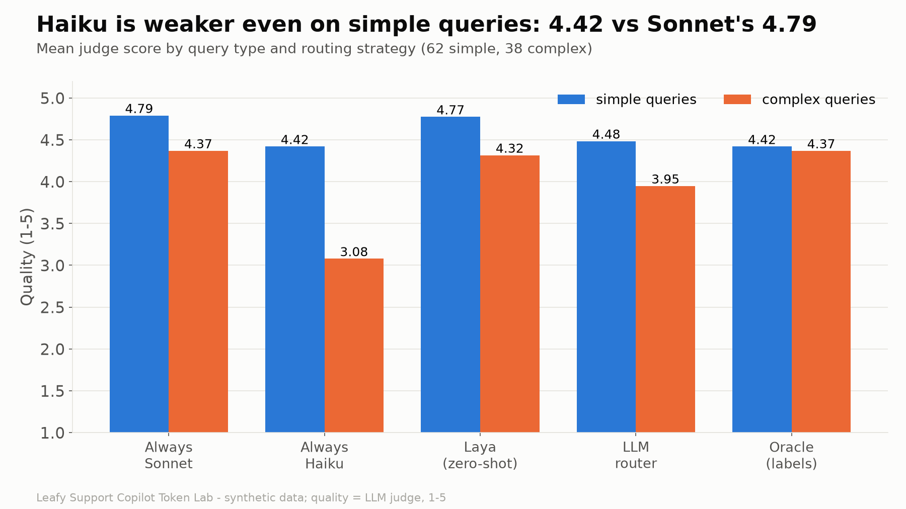
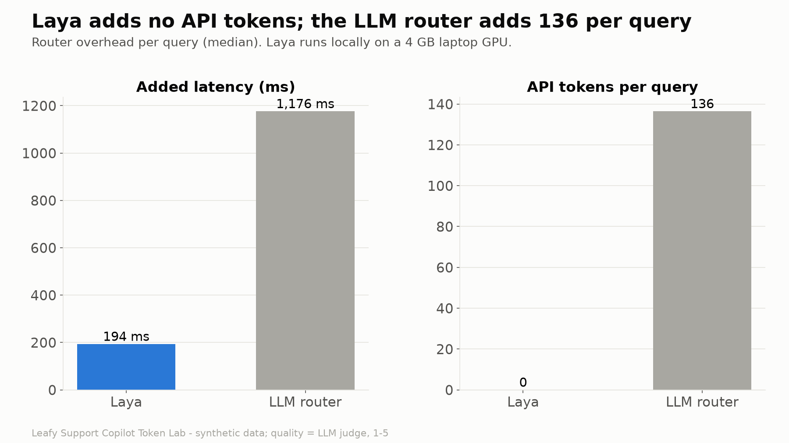
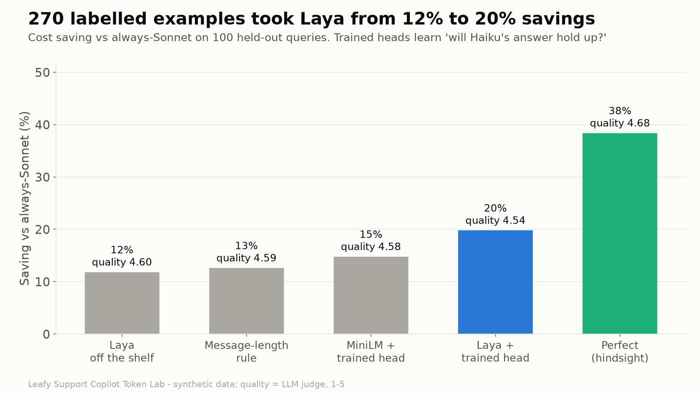
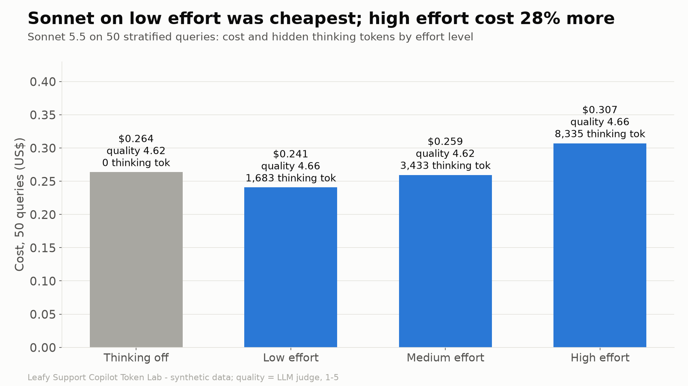

## Setup (Windows PowerShell)

```powershell
py -3.12 -m venv .venv
.\.venv\Scripts\python.exe -m pip install -r requirements.txt
# optional GPU for Laya (RTX-class, CUDA 13 driver):
.\.venv\Scripts\python.exe -m pip install torch==2.14.1 --index-url https://download.pytorch.org/whl/cu130
```

**Model access.** `config.yaml: backend` selects how models are called:

- `cli` (used for these results): Claude Code headless (`claude -p`) on a Claude subscription. Each run first measures the
  fixed hidden overhead Claude Code adds to every request (constant within a run, re-checked at the end) and subtracts it, so
  logged tokens are the API's own usage counts minus that overhead. Caching is priced by the documented API rules, and the
  output cap is applied exactly as the API would.
- `api`: the Anthropic API directly. Put `ANTHROPIC_API_KEY` in `.env` (git-ignored) and set `backend: api`.

## Run

```powershell
.\.venv\Scripts\python.exe -m qa.qa_checkpoint_1      # data QA gate
.\.venv\Scripts\python.exe -m eval.dry_run            # 10-query dry run, then: python -m qa.qa_checkpoint_2
.\.venv\Scripts\python.exe -m eval.run_eval           # full eval: variants, routing, effort, judge -> results/*.csv
.\.venv\Scripts\python.exe -m qa.qa_eval              # eval QA gate
.\.venv\Scripts\python.exe -m eval.router_head_data   # training data for the routing head
.\.venv\Scripts\python.exe -m eval.train_router_head  # train + test the head (local, no API calls)
.\.venv\Scripts\python.exe -m report.make_charts      # charts -> report/*.png, then: python -m qa.qa_charts
.\.venv\Scripts\python.exe -m blog.build_site         # article page -> blog/site/
```

Every model call is stored in `results/cache/` by request hash, so a re-run reproduces every CSV from a clean clone
without new model calls (only the overhead calibration runs).

## Limitations

- Synthetic data; one model wrote both the test and the router-training questions, which flatters the trained router.
- Quality is an LLM judge (re-scoring the same answers gives the identical score ~78% of the time); differences under ~0.1 in
  mean quality are noise. 20 answers were hand-checked (`qa/reports/judge_handcheck.md`).
- 100 queries is a small sample; the effort comparison uses 50.
- Measured through Claude Code's CLI with its overhead subtracted; latency is the API time it reports (comparative only).
- Prompt-cache savings are priced by API rules on the CLI backend, not observed.

## Next steps

- Streamlit side-by-side demo app (`app.py`).
- Router trained on real traffic, labelled by whether the cheap model's answer held up.
- Per-intent routing rules and a weekly quality guardrail on sampled production answers.

QA reports for every gate are in `qa/reports/`.
