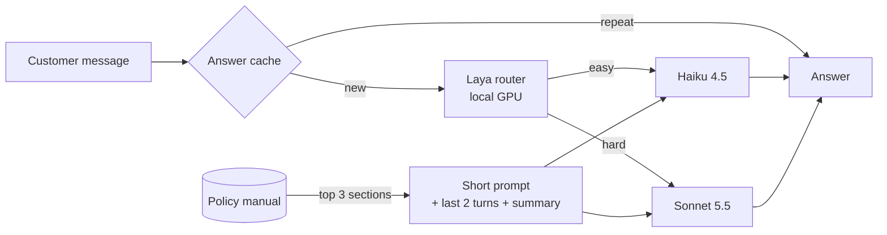

# I cut an AI support bot's cost by 64%. The famous router did a sixth of it.

*Same chatbot, built twice. 140 answers each, every token counted.*

Token cost is one of the biggest brakes on LLM adoption. Before accepting it as the price of AI, I wanted to see how much of it can be engineered away. So I built one small AI app twice, a quick version and a careful one, and measured what each costs to run.

## How this works, in one minute

**The app.** A customer-support chatbot for Leafy, a made-up online plant shop. A customer asks something like "What's your return window?" or "My plant arrived dead and I was charged twice", and the bot answers from Leafy's policy manual, a document of about 3,600 tokens. It runs on Anthropic's Claude models; everything is invented.

**Two versions.** Version 1 is built the quick way: every question goes to the strongest, most expensive model (Sonnet 5.5), with the whole manual and the whole chat attached. Version 2 adds cost-saving fixes one at a time.

**The test.** Both versions answer the same 100 customer questions (62 simple, 38 complex) and 10 back-and-forth conversations: 140 answers each.

**Counting tokens and cost.** AI models bill per token (about three-quarters of a word), for text sent and text written back. For every answer I recorded the token counts reported by the model provider, not estimates, and multiplied them by the published prices: Sonnet 5.5 costs $2 per million tokens sent and $10 per million written; the cheaper Haiku 4.5 costs $1 and $5. Adding up 140 answers gives each version's bill.

**Checking quality.** Cheaper is worthless if answers get worse. A separate AI grader scored every answer from 1 to 5 against a reference answer written from the manual: 5 means send it as is, 3 means acceptable but flawed.

**The result.** Version 2 answered the same 140 questions for **$0.69 instead of $1.95**: 64% cheaper, with 66% fewer tokens. Average quality moved from 4.63 to 4.49. The surprise was where the savings came from.

## Why teams ship the expensive version

Version one of most AI features is built to ship: best model, whole manual, whole chat. It works, so nobody touches it. Shipping beats tuning, a quality drop nobody can measure feels risky, and nobody owns cost per answer. But token cost is a product decision, not an infra bill.

## Where tokens leak

1. **The wrong model**: every question goes to the strongest one.
2. **The whole manual**: sent with every call.
3. **The whole conversation**: resent every turn.
4. **The essay prompt**: 650 tokens of instructions where 170 do the job.
5. **The long answer**: no length guidance.
6. **The repeat question**: answered from scratch.

## The fixes, step by step

Each row adds one fix and re-runs the test:

| Step added | Cost (140 answers) | Quality |
|---|---|---|
| v1: strongest model, full manual, full history | $1.95 | 4.63 |
| + routing: Laya sends easy questions to the cheap model | $1.75 | 4.56 |
| + retrieval: send only the 3 most relevant manual sections | $1.12 | 4.34 |
| + history: last 2 turns plus a summary | $1.12 | 4.39 |
| + short prompt, cached | $0.91 | 4.40 |
| + "be concise" and an answer cache = v2 | $0.69 | 4.49 |

## What happened

**Retrieval did half the work.** Sending three manual sections instead of the whole thing saved $0.63 of the $1.26. It also caused most of the quality loss: 14 answers dropped two points or more, usually because the right section was missed and the model honestly said it didn't know.

**Some fixes barely mattered.** Trimming history saved 0.5% of v1's cost. The prompt cache, which bills a repeated prompt opening at a tenth of the price, saved nothing: the short prompt left only 203 repeatable tokens, under the 512 it needs. The answer cache never fired because no test question repeated.

**The surprise was a build I added myself.** The short prompt plus the *whole* manual, cached, scored 4.80, against v1's 4.63, at 62% below v1's cost. It fixed 20 answers by two points or more and made none worse. On this model, caching the manual beat searching it.

## Did Laya earn its place?

Laya is a small open-source decision model that runs on a laptop GPU. It scores each question; above a cut-off, the question goes to the strong model.

Out of the box, it saved **12%** against always using the strong model, at the same quality (4.60 vs 4.63): about a sixth of the total saving. It still sent 45 of the 62 simple questions to the expensive model.

It did beat asking the cheap model to classify each question first, which cost 136 extra tokens and 1,176 ms per question; Laya took 194 ms and no API tokens. Laya saves cost, not tokens: the same prompt simply goes to a cheaper model.

Then I trained it on 270 new questions, each labelled by whether the cheap model's answer held up. Laya's saving rose from **12% to 20%** at 4.54 quality. A router with perfect hindsight would save 38%.

"Simple" to a human isn't "safe for the cheap model": the cheap model scored 4.42 on simple questions where the strong model scored 4.79. A router is only as good as the outcome it learned to predict.

## The trade-off I had to make

The cut-off is a product call. I fixed the rule before looking: the cheapest setting where complex-question quality stays within 0.2 of always-strong. That picked 0.50. One notch higher, complex quality fell from 4.32 to 4.00.

The second dial is effort: how much hidden reasoning the strong model does before answering. On 50 questions, low effort was 9% cheaper than reasoning off, at the same quality; high effort used 8,335 reasoning tokens against 1,683 and cost 28% more for no gain. Trained Laya plus low effort saved 26% at equal quality.

## What I'd ship

I'd ship the cached whole-manual build, not v2. It cost 8% more than v2 and scored best, though on 140 synthetic answers read that as "at least as good as v1". At a million answers a month: about $5,368 against v1's $13,946.

Around it:

- **A quality guardrail**: score a sample of real answers every week.
- **Confidence-based escalation**: when the router is unsure, pay for the strong model.
- **Per-intent rules**: billing disputes and safety questions never go to the cheap model.
- **Cost per resolved ticket** as the north-star metric, not cost per call.
- **Drift monitoring**: re-label traffic monthly and retrain the router.

Not worth optimising here: history trimming and high effort.

## A reusable framework

Before any LLM call, ask:

1. **Does this need the smartest model?** Measure it; "simple" fooled me.
2. **Does it need all this context?** Cutting it was the biggest saving and the biggest risk.
3. **Have we answered this before?** Cache the repeated part, prompt or answer.

## Limitations

The data is synthetic, and one AI wrote both test and training questions, which flatters the trained router. An AI judge scored quality: re-scoring the same answers gave the identical score 78% of the time, and I agreed with 17 of 20 hand-checked scores. With 100 questions, gaps under 0.1 in average quality are noise. Laya ran off the shelf on a new domain, where its scores bunch together. Million-answer figures scale up 140 synthetic answers. I ran the models through Claude Code's command line and subtracted the fixed overhead it adds to every call.

## Try it

Code, data and every result: [rvshankar45-jpg/Laya-model-router](https://github.com/rvshankar45-jpg/Laya-model-router).

What's your team's cost per answer? If you don't know, that's the first number to find.
