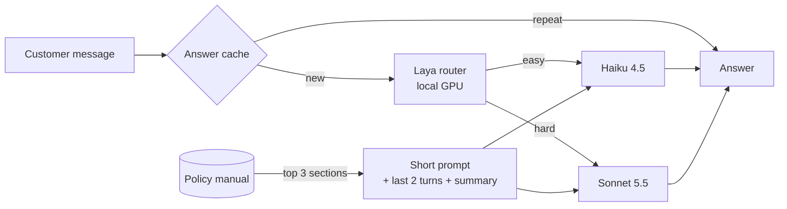

# I cut an AI support bot's cost by 64%. The famous router did a sixth of it.

*Same chatbot, built twice. 140 answers each, every token counted.*

Token cost is one of the biggest brakes on LLM adoption. Before accepting it as the price of AI, I wanted to see how much of it can be engineered away. So I built one small AI app twice, a quick version and a careful one, and measured what each costs to run.

## How this works, in one minute

**The app.** A customer-support chatbot for Leafy, a made-up online plant shop. A customer asks something like "What's your return window?" and the bot answers from Leafy's [policy manual](https://github.com/rvshankar45-jpg/Laya-model-router/blob/main/data/kb.md), a document of about 3,600 tokens in 9 sections. It runs on Claude models; all data is invented.

**Two versions.** Version 1 is built the quick way: every question goes to the strongest, most expensive model (Sonnet 5.5), with the whole manual and the whole chat attached. Version 2 adds six cost-saving fixes, one at a time.

**The test.** Both versions answer the same 100 customer questions (62 simple, 38 complex) and 10 back-and-forth conversations: 140 answers each.

**Counting tokens and cost.** AI models bill per token (about three-quarters of a word), for text sent and text written back. For every answer I recorded the token counts reported by the model provider, not estimates, and multiplied them by the published prices: Sonnet 5.5 costs $2 per million tokens sent and $10 per million written; the cheaper Haiku 4.5 costs $1 and $5.

**Checking quality.** A separate AI grader scored every answer from 1 to 5 against a reference answer written from the manual: 5 means send it as is, 3 means acceptable but flawed.

## The short version

1. **It cost 64% less to run, with answers almost as good.** The optimised chatbot answered the same 140 customer questions for $0.69 instead of $1.95. A grader scored its answers 4.49 out of 5, against 4.63 for the original.
2. **The biggest saving came from sending the AI less text.** Instead of pasting the whole policy manual into every request, the bot looked up the 3 most relevant sections and sent only those (a technique called RAG). That alone delivered half of the saving, but it also caused most of the drop in quality, because it sometimes picked the wrong sections.
3. **The best version sent the whole manual, but stored it.** AI providers let you store text you send over and over, and charge a tenth of the price to reuse it. Sending the full manual this way was 62% cheaper than the original and gave the best answers of all: 4.80.
4. **Sending easy questions to a cheaper AI saved less than expected.** A small "router" model decides which questions the cheaper AI can handle. Off the shelf it saved 12%; trained on 270 examples, 20%.
5. **Letting the AI think longer cost more and didn't help.** Newer models can reason privately before answering, and you pay for that hidden reasoning. A little thinking was the cheapest setting; the most thinking cost 28% more with no better answers.

## Why teams ship the expensive version

The first version of most AI features is built to ship fast: the best model, the whole manual, the whole chat. It works, so nobody touches it. Shipping beats tuning, a quality drop nobody can measure feels risky, and nobody owns cost per answer. But token cost is a product decision, not an infra bill.

## The six fixes, explained

Each fix targets one way tokens leak:

| Where tokens leak | The fix in version 2 |
|---|---|
| Every question goes to the expensive model | **Routing:** a small local model, Laya, sends easy questions to the cheap model |
| The whole manual is sent with every question | **Retrieval (RAG):** send only the 3 manual sections most related to the question |
| The whole conversation is resent every turn | **History trimming:** keep the last 2 turns plus a short summary |
| 650 tokens of instructions where 170 do the job | **Short prompt:** a 170-token version |
| The same opening text is paid for at full price every time | **Prompt cache:** the provider stores repeated opening text and bills it at a tenth of the price |
| Answers run long; repeat questions start from scratch | **Concise answers + answer cache:** a "be concise" instruction and length cap, and reuse of answers to repeated questions |

## What each fix saved

Each row adds one fix and re-runs the whole test:

| Step | Cost (140 answers) | Quality |
|---|---|---|
| Version 1 | $1.95 | 4.63 |
| + routing | $1.75 | 4.56 |
| + retrieval | $1.12 | 4.34 |
| + history trimming | $1.12 | 4.39 |
| + short prompt and prompt cache | $0.91 | 4.40 |
| + concise answers and answer cache = version 2 | $0.69 | 4.49 |

**Retrieval (RAG) gave the biggest saving, and the biggest quality drop.**

*How it works.* Version 1 pasted all 9 sections of the manual into every request. With retrieval, the bot first searches the manual and sends only the 3 sections that best match the question. It scores each section twice, once for shared words and once for similar meaning, and keeps the top 3.

*The saving.* Sending a third of the manual means far fewer tokens on every call. That one change cut $0.63, half of the $1.26 saved in total.

*The catch.* If the search picks the wrong sections, the model never sees the answer. Asked "What's your price adjustment policy?", the bot was sent the Orders, Returns and Contact sections, not Payments and Refunds, where the policy lives. It replied that no such policy existed, and its grade fell from 5 to 1. When retrieval was switched on, 14 of the 140 answers lost two or more points.

**Some fixes barely mattered.** Trimming history saved 0.5% of version 1's cost. The prompt cache saved nothing: the short prompt left only 203 repeatable tokens, under the 512 it needs. No test question repeated, so the answer cache never fired; shorter answers drove the last step.

**The surprise was a build I added myself:** the short prompt plus the *whole* manual, cached. It scored 4.80, against version 1's 4.63, at 62% below version 1's cost. Compared with the same setup using RAG, it was cheaper and better:

| Same setup, except | Cost (140 answers) | Quality |
|---|---|---|
| RAG: 3 sections per question | $0.91 | 4.40 |
| Whole manual, cached | $0.75 | 4.80 |

Retrieved sections change with every question, so they're billed at full price every time. The whole manual is identical on every call, so after the first one it's billed at a tenth of the price. Caching was 17% cheaper, fixed 20 answers by two points or more and made none worse.

**That doesn't make caching better than RAG in general.** Caching the whole document costs about the same as sending a tenth of it. Retrieval sent a third, so caching won here; RAG wins when the passages you retrieve are under a tenth of the document, or when the document is too big to send. A cache also lasts only about 5 minutes, so with quiet traffic it keeps expiring and is rewritten at a premium. For a small manual and steady traffic, cache it; for a large knowledge base or quiet traffic, use RAG; measure both on your own data.

## How the search picks sections

Retrieval is plain search, with no AI writing involved. Five steps:

1. **Split.** The [manual](https://github.com/rvshankar45-jpg/Laya-model-router/blob/main/data/kb.md) is cut at its 9 headings, one searchable chunk per section.
2. **Keyword score.** Each section scores higher the more of the question's words it contains. Rare words count more, and long sections aren't favoured just for being long (a standard search formula called BM25).
3. **Meaning score.** A small free open-source model, [all-MiniLM-L6-v2](https://huggingface.co/sentence-transformers/all-MiniLM-L6-v2), turns the question and each section into a list of 384 numbers that capture meaning, so "can I send it back?" lands near Returns even without a shared word.
4. **Combine.** Each method ranks the 9 sections. A section's final score is 1/(60 + keyword rank) + 1/(60 + meaning rank), so sections that do well on both rise to the top.
5. **Send the top 3**, in the order they appear in the manual. In conversations, the customer's previous message joins the search, so follow-ups still find the right section.

**Why 3?** The number came from the project brief, and the data backs it. Using as a stand-in the section that best matches each question's reference answer:

| Sections sent | Right section found | Share of manual sent |
|---|---|---|
| 1 | 74% | 11% |
| 2 | 89% | 22% |
| 3 | 95% | 33% |
| 4 | 96% | 44% |
| 5 | 97% | 56% |

Going from 2 to 3 sections finds the right one far more often; beyond 3, each extra section adds about a point while sending another ninth of the manual on every call.

**Why the price-adjustment question failed:**

| Section | Keyword rank | Meaning rank | Final rank |
|---|---|---|---|
| Contact and Escalation | 1 | 4 | 1, sent |
| Returns | 4 | 2 | 2, sent |
| Orders | 3 | 5 | 3, sent |
| Shipping | 5 | 3 | 4 |
| Subscriptions and Membership | 8 | 1 | 5 |
| **Payments and Refunds** (the right one) | 2 | 7 | 6 |

The manual calls it a "price drop", not a "price adjustment", so "adjustment" matched nothing, while "policy" pulled in the Contact section. Keywords still put Payments 2nd, but the meaning model ranked it 7th, so it finished 6th and was never sent. Smaller chunks (one per policy), synonyms in the headings, or a stronger meaning model would likely catch it; I haven't tested those yet.

## Does a smarter router help?

Laya is a small open-weights decision model. It scores each question for difficulty; above a cut-off, the question goes to the expensive model.

**Why Laya?** It decides in one pass instead of writing text, so it runs on a laptop GPU in a fraction of a second and costs no API tokens. It returns a probability, so the cut-off is mine to set. And it can be retrained on my own data.

Out of the box, it saved **12%** against always using the expensive model, at the same quality (4.60 vs 4.63): about a sixth of the total saving. It still sent 45 of the 62 simple questions to the expensive model.

Asking the cheap model to classify each question instead cost 136 extra tokens and 1,176 ms per question; Laya took 194 ms and none. Laya saves cost, not tokens: the same prompt goes to a cheaper model.

The cut-off is a product call. I fixed the rule before looking: the cheapest setting where quality on complex questions stays within 0.2 of always-expensive. That picked 0.50. One notch higher, complex quality fell from 4.32 to 4.00.

## Teaching Laya: the fine-tuning experiment

Off the shelf, Laya judged whether a message *looks* complex, not whether the cheap model would cope. Its separation score, how well it tells those two apart, was 0.63, where 0.5 is guessing and 1 is perfect.

So I taught it, in four steps:

1. **New questions.** An AI wrote 270 fresh questions; any resembling a test question were dropped.
2. **Real labels.** Both models answered each one and the grader scored both. The label: did the cheap model do as well? It did on 37%.
3. **Train only the decider.** Laya has a large "reader" that turns a message into numbers and a small "decider" on top. I froze the reader and trained a new decider in minutes.
4. **A fair test.** The cut-off was set on the training questions, then the router was scored once on the 100 test questions.

How to read the table: *saving vs always-expensive* is how much cheaper the bill was than sending every question to the expensive model; *quality* is the average grade out of 5; *sent to cheap model* is the share of the 100 test questions the router handed to the cheap model. More sent to the cheap model means more saving, as long as quality holds.

| Router | Saving vs always-expensive | Quality | Sent to cheap model |
|---|---|---|---|
| Laya off the shelf | 12% | 4.60 | 20% |
| Message-length rule | 13% | 4.59 | 23% |
| Small free model + trained decider | 15% | 4.58 | 27% |
| **Laya + trained decider** | **20%** | 4.54 | 36% |
| Perfect hindsight | 38% | 4.68 | 60% |

**What the 20% means.** On the 100 test questions, sending everything to the expensive model cost $0.517. With the trained decider choosing, the same questions cost $0.415: 20% less. It saved more than off-the-shelf Laya because it sent 36% of questions to the cheap model instead of 20%, and quality dipped only from 4.63 to 4.54. Note the baseline: this is against always using the expensive model, not against version 1.

**What "perfect hindsight" means.** Because the grader scored both models' answers to every question, we know afterwards exactly where the cheap model's answer was as good. A perfect router would send only those questions to the cheap model: 60% of them, saving 38% and even raising quality to 4.68. No real router can do this, since it would need both answers before choosing; it's the ceiling for how much routing could ever save here.

The trained Laya's separation score rose from 0.63 to 0.75. Across 2,000 resamples of the test questions, the extra saving was positive in 1,991, between 2 and 15 points; the quality change stayed within noise. A word-count rule separated almost as well (0.76), because my hard questions are longer, but saved only 13%.

The lesson: "simple" to a human isn't "safe for the cheap model" (the cheap model scored 4.42 on simple questions, the expensive one 4.79). Laya is a strong base, not a finished router: a few hundred labelled examples nearly doubled its savings, and real tickets plus the full fine-tuning recipe ([Laya model card](https://huggingface.co/convaiinnovations/laya)) should push it towards the 38% ceiling.

## Should the expensive model think harder?

You choose how much the model reasons with an "effort" setting, and pay for that hidden thinking as output tokens. I ran the expensive model at each setting on 50 of the questions (30 simple, 20 complex):

| Thinking setting | Cost (50 questions) | Hidden thinking tokens | Quality | Complex questions | Typical wait |
|---|---|---|---|---|---|
| Off | $0.264 | 0 | 4.62 | 4.45 | 2.5 s |
| Low | $0.241 | 1,683 | 4.66 | 4.60 | 2.3 s |
| Medium | $0.259 | 3,433 | 4.62 | 4.50 | 2.6 s |
| High | $0.307 | 8,335 | 4.66 | 4.65 | 3.5 s |

**Low effort was the cheapest and fastest setting**, 9% below thinking off at the same quality, because its visible answers were shorter. High effort used five times the hidden tokens of low and cost 28% more for no measurable gain.

Combined with the trained Laya router, low-effort thinking saved 26% at equal quality.

## What I'd ship

I'd ship the cached whole-manual build, and test it with low-effort thinking, a pairing I haven't measured yet. It cost 8% more than version 2 and scored best, though on 140 synthetic answers read that as "at least as good as version 1". At a million answers a month: about $5,368 against version 1's $13,946.

- **A quality guardrail**: score a sample of real answers every week.
- **Per-intent rules**: billing disputes and safety questions never go to the cheap model.
- **Cost per resolved ticket** as the north-star metric, not cost per call.

Not worth optimising: history trimming and high effort.

## A reusable checklist

Before any LLM call, ask:

1. **Does this need the smartest model?** Measure it; "simple" fooled me.
2. **Does it need all this context?** Cutting it was the biggest saving and the biggest risk.
3. **Have we answered this before?** Cache the repeated part, prompt or answer.

## Limitations

The data is synthetic, and one AI wrote both test and training questions, which flatters the trained router. An AI judge scored quality: re-scoring the same answers gave the identical score 78% of the time, and I agreed with 17 of 20 hand-checked scores. With 100 questions, gaps under 0.1 in average quality are noise. Million-answer figures scale up 140 synthetic answers. Models ran through Claude Code's command line, with its fixed per-call overhead subtracted.

## Try it

Code, data and every result: [rvshankar45-jpg/Laya-model-router](https://github.com/rvshankar45-jpg/Laya-model-router).

What's your team's cost per answer? If you don't know, that's the first number to find.

## More writing

- [They answered 99% of the angry reviews. Nothing got fixed.](https://rvshankar45-jpg.github.io/nothing-got-fixed/) Do delivery apps fix what users complain about in their reviews?
- [Better listing photos, without asking sellers for more.](https://rvshankar45-jpg.github.io/listing-ready-photos/) Can open image models clean up second-hand listing photos as well as GPT?
